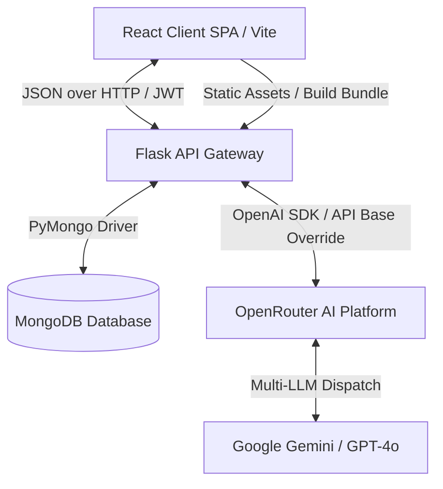

# AURA STUDIO — A TO Z TECHNICAL DOCUMENTATION & ARCHITECTURAL REFERENCE

Welcome to the official technical blueprint of **Aura Studio**. This document provides an exhaustive, end-to-end breakdown of the application architecture, system workflows, database models, API design, and front-to-back integration pathways. It is designed to serve as both a developer reference and a presentation guide for hackathon examiners.

---

## 📁 1. System Architecture & High-Level Design

Aura Studio is built using a modern **Decoupled Single Page Application (SPA)** architecture, powered by a Flask backend service and a Vite+React client. It is configured for instant cloud deployment, serving both API endpoints and bundled static files from a unified web server.



### Key Architectural Highlights
*   **Unified Server Routing:** Flask serves the React compilation bundle (`dist/`) directly, routing all backend APIs under `/api/*` and redirecting any browser-side SPA client paths to `index.html` via a fallback catch-all router.
*   **Stateful AI Interactions:** Context-aware conversations and multimodal image scanning communicate with state-of-the-art LLMs via **OpenRouter**, maintaining fallback rule-based heuristics if rate limits occur or offline operation is required.
*   **Glassmorphic Custom UI Design:** Features immersive, responsive styles using CSS-variables-driven custom components, real-time WebGL backdrops, dynamic layout transitions, and interactive visual elements.

---

## 🛠️ 2. Core Technology Stack & Dependencies

### Backend Service Tier (Python)
*   **Flask (v3.0.x):** Light-weight micro-framework for endpoint routing and static asset delivery.
*   **PyMongo (v4.6.x):** Asynchronous-compatible driver interface connecting the Flask tier to MongoDB.
*   **PyJWT (v2.8.x):** Secure token issuer utilizing HMAC-SHA256 signatures to authorize API requests.
*   **Bcrypt (v4.1.x):** Blowfish-based hashing function for salting and verifying user passwords safely.
*   **OpenAI SDK (v0.28.x):** Configured with custom base URLs (`OPENAI_API_BASE`) to route chat and computer vision requests through OpenRouter's free and premium tiers.
*   **Python-Dotenv (v1.0.x):** Secure environment variables loader for API credentials, server settings, and database URIs.

### Frontend Client Tier (JavaScript/React)
*   **React (v18.3.x) & Vite:** Core layout builder and ultra-fast hot-reloading development server.
*   **React Router Dom (v6.22.x):** Client-side dynamic routing engine managing page histories and route guards.
*   **Lucide React (v0.344.x):** Vector-based cyber-aesthetic icon suite matching the interface.
*   **WebGL / Canvas:** Powers interactive three-dimensional particle grids that respond to mouse movements.
*   **TailwindCSS & Custom CSS System:** Utilizes advanced CSS variables (supporting live dark-mode and light-mode neon transitions) linked to system controls.

---

## 💾 3. Database Schema & Data Models (MongoDB)

Aura Studio employs **MongoDB** due to its JSON-like document structure, facilitating rapid schema iterations. Below are the structural diagrams and definitions of the collections:

### 3.1 Users Collection (`users`)
Stores registration details, role access definitions, and Elite membership status.
```json
{
  "_id": "ObjectId",
  "name": "Jane Doe",
  "email": "jane@example.com",
  "username": "jane_doe",
  "password": "hashed_bcrypt_password_string",
  "phone": "9876543210",
  "role": "user | stylist | admin",
  "membership_tier": "standard | elite",
  "membership_expires_at": "ISO-8601 DateTimeString (optional)"
}
```

### 3.2 Services Collection (`services`)
Defines the salon treatment menu, pricing scales, and durations.
```json
{
  "_id": "ObjectId",
  "name": "Signature Precision Cut",
  "description": "Futuristic sharp lines matching your facial structure.",
  "duration_minutes": 45,
  "price": 65.00
}
```

### 3.3 Appointments Collection (`appointments`)
Manages reservations, status workflows, and billing pointers.
```json
{
  "_id": "ObjectId",
  "user_id": "ObjectId (Ref: users)",
  "service_id": "ObjectId (Ref: services)",
  "appointment_date": "YYYY-MM-DD",
  "appointment_time": "HH:MM",
  "notes": "Prefer scissor styling over clippers.",
  "status": "pending | confirmed | cancelled",
  "payment_id": "string (optional, Ref: payments)",
  "payment_status": "unpaid | paid",
  "appointment_token": "string (unique identifier for client lookup)",
  "created_at": "ISODate",
  "updated_at": "ISODate"
}
```

### 3.4 Payments Collection (`payments`)
Tracks invoices, transaction hashes, and loyalty discount details.
```json
{
  "_id": "ObjectId",
  "payment_id": "string (unique custom prefix pay_*)",
  "order_id": "string (unique custom prefix order_*)",
  "appointment_id": "ObjectId (Ref: appointments)",
  "user_id": "ObjectId (Ref: users)",
  "service_id": "ObjectId (Ref: services)",
  "amount": 52.00,
  "payment_method": "simulated",
  "status": "paid",
  "invoice_number": "INV-XXXX",
  "qr_payload": "AURA|pay_id|appointment_id|user_id",
  "created_at": "ISODate"
}
```

---

## 📡 4. Backend Endpoints Map (API Specification)

All API calls return standard HTTP status codes (`200 OK`, `201 Created`, `400 Bad Request`, `401 Unauthorized`, `409 Conflict`) with JSON payloads.

| Category | Endpoint | Method | Authentication | Payload Details | Description |
| :--- | :--- | :--- | :--- | :--- | :--- |
| **Auth** | `/api/register` | `POST` | None | `{ name, email, password, phone }` | Registers a new standard customer. |
| **Auth** | `/api/login` | `POST` | None | `{ email, password }` | Authenticates client; returns JWT token + user details. |
| **Auth** | `/api/admin-login` | `POST` | None | `{ username, password }` | Authenticates admin/stylist; returns staff JWT token. |
| **Auth** | `/api/profile` | `GET` | JWT (Header) | None | Fetches authenticated user's profile card. |
| **Auth** | `/api/profile` | `PUT` | JWT (Header) | `{ name, phone }` | Updates profile configuration. |
| **Booking**| `/api/appointments/book` | `POST` | JWT (Header) | `{ service_id, date, time, notes }` | Checks availability, locks slot, creates appointment. |
| **Booking**| `/api/appointments` | `GET` | JWT (Header) | None | Retrieves all appointments for the logged-in client. |
| **Booking**| `/api/appointments/<id>`| `GET` | JWT (Header) | None | Gets details of a specific reservation. |
| **Booking**| `/api/appointments/<id>`| `PUT` | JWT (Header) | `{ date, time, notes }` | Updates dates/times (with collision safety). |
| **Booking**| `/api/appointments/<id>/cancel` | `POST` | JWT (Header) | None | Marks an appointment as cancelled. |
| **Booking**| `/api/appointments/available-slots` | `GET` | None | Query: `?date=YYYY-MM-DD` | Returns lists of open and booked hours. |
| **Services**| `/api/services` | `GET` | None | None | Lists all available treatments in the shop. |
| **Services**| `/api/services` | `POST` | JWT (Staff) | `{ name, description, duration_minutes, price }` | Creates a new treatment option. |
| **Services**| `/api/services/<id>` | `PUT` | JWT (Staff) | `{ name, description, price, ... }` | Modifies service details. |
| **Services**| `/api/services/<id>` | `DELETE`| JWT (Staff) | None | Removes a service from catalog. |
| **Payments**| `/api/payments/pay` | `POST` | JWT (Header) | `{ appointment_id }` | Generates receipt, calculates discounts, stores transaction. |
| **Payments**| `/api/payments/invoice/<pay_id>` | `GET` | JWT (Header) | None | Returns receipt payload and invoice details. |
| **Payments**| `/api/payments/history` | `GET` | JWT (Header) | None | Retrieves transaction history for user. |
| **Elite** | `/api/memberships/purchase` | `POST` | JWT (Header) | None | Grants user Elite tier benefits (20% discounts). |
| **AI Modules**| `/api/virtual-mirror/detect` | `POST` | None | `{ imageData: "base64..." }` | Calls Vision LLM to extract face properties. |
| **AI Modules**| `/api/virtual-mirror/recommendation` | `POST` | None | `{ faceShape, hairline, hairTexture, maintenance, ... }` | Prompts LLM for custom style match lists. |
| **AI Modules**| `/api/chat` | `POST` | None | `{ messages: [...] }` | Submits cleaned conversational logs to AI Concierge. |

---

## 🛠️ 5. Key System Integrations & Code Walkthrough

### 5.1 Real-Time Webcam Face Analyzer & Fallback Matrix
In `virtualMirrorController.py`, the facial analysis executes on the user's base64-encoded webcam frames:

1.  **AI Mode:** The client uploads a webcam frame as a `base64` image URI.
2.  **Multimodal Vision Pipeline:** The backend builds a prompt instructing the LLM (`AI_VISION_MODEL`) to classify the user's jaw structure, temporal hair density, and follicle textures into rigid JSON categories.
3.  **Fallback Heuristics:** If the AI is rate-limited, offline, or unconfigured, the code falls back to rule-based lookups (`FACE_STYLE_MAP`) to prevent app crashes and display realistic suggestions:
    *   *Round face shape* -> Recommends a **Textured Pompadour** or **Side-Swept Crop** to add structural height.
    *   *Square face shape* -> Recommends a **Textured Crop** or **Curtain Fringe** to soften sharp jaw lines.

```python
# Fallback Heuristics Matrix snippet
def local_recommendation(inputs: dict) -> dict:
    face_shape = inputs['faceShape']
    hairline = inputs['hairline']
    maintenance = inputs['maintenance']
    guide = FACE_STYLE_MAP.get(face_shape, FACE_STYLE_MAP['oval'])
    
    # Custom adjustments based on hairline inputs
    # Returns structured recommendation objects
```

### 5.2 AI Chat Message Sanitization & Role Sequencing
When querying chat completion interfaces (like Gemini on OpenRouter), the message history must start with a `user` prompt and alternate roles. In `chatController.py`, we sanitize client histories before API transmission:

```python
# Clean the message chain to prevent API errors
cleaned_messages = []
for msg in messages:
    role = msg.get("role")
    content = msg.get("content")
    if role == "system":
        continue
    cleaned_messages.append({"role": role, "content": content})

# Remove any leading assistant greetings (rejections happen if assistant speaks first)
while cleaned_messages and cleaned_messages[0]["role"] == "assistant":
    cleaned_messages.pop(0)
```

### 5.3 Collision-Free Scheduling Logic
To ensure that double bookings never occur, `appointmentController.py` executes dynamic slot-validation queries prior to committing reservations to the database:

```python
# Check for existing bookings at the exact date and time
existing = appointments.find_one({
    "appointment_date": date,
    "appointment_time": time,
    "status": {"$ne": "cancelled"} # Ignores cancelled bookings
})
if existing:
    return jsonify({"message": "Time slot already booked"}), 409
```

### 5.4 Theme Engine & CSS Variables Syncing
To prevent styling inconsistencies on load, `Navbar.jsx` checks `localStorage` during initial state setup. It updates class flags directly on the `document.documentElement` node to instantly switch dark/light variables before the page renders:

```javascript
const [isLightTheme, setIsLightTheme] = useState(() => {
  const saved = localStorage.getItem('theme');
  return saved === 'light';
});

useEffect(() => {
  if (isLightTheme) {
    document.documentElement.classList.add('light');
    document.documentElement.setAttribute('data-theme', 'light');
    localStorage.setItem('theme', 'light');
  } else {
    document.documentElement.classList.remove('light');
    document.documentElement.setAttribute('data-theme', 'dark');
    localStorage.setItem('theme', 'dark');
  }
}, [isLightTheme]);
```

---

## 🎨 6. Premium Glassmorphic User Interface Elements

Aura Studio's visual style is designed to look modern and premium:

*   **Interactive WebGL Grid:** Draws a three-dimensional coordinate map that moves relative to mouse movement, creating depth.
*   **Glassmorphism Framework:** Containers utilize thin translucent borders (`backdrop-filter: blur(16px)`) with light-emitting outer shadows.
*   **Virtual Scanner HUD:** Superimposes animated bounding paths over the live camera element to represent geometric calculations in progress.
*   **AuthToast Interceptor:** Displays custom top-right overlay alerts with glow outlines instead of throwing unhelpful redirect errors, prompting users to authenticate naturally.

---

## 🚀 7. Step-by-Step Setup & Running Guide

### 7.1 Prerequisite Installations
*   Python 3.10 or higher.
*   Node.js v18 or higher + npm.
*   MongoDB Local Community Edition (or MongoDB Atlas link).

### 7.2 Configuration Setup (.env)
Create a `.env` file in the root project folder:
```ini
MONGO_URI=mongodb://localhost:27017/appointment_booking
JWT_SECRET=super_secret_cyber_key_99
OPENAI_API_KEY=your_openrouter_api_key
OPENAI_API_BASE=https://openrouter.ai/api/v1
AI_CHAT_MODEL=google/gemini-2.0-flash-exp:free
AI_VISION_MODEL=google/gemini-2.0-flash-exp:free
```

### 7.3 Running the Application Locally
1.  **Start MongoDB:** Ensure the local MongoDB database is running on port 27017.
2.  **Start Flask Backend Server:**
    ```bash
    python -m venv .venv
    # Windows:
    .venv\Scripts\activate
    # macOS/Linux:
    source .venv/back/activate
    
    pip install -r requirements.txt
    python app.py
    ```
    *(The backend will seed initial stylists and `admin` automatically)*.
3.  **Start React Frontend (in a separate terminal):**
    ```bash
    cd frontend
    npm install
    npm run dev
    ```
4.  Open `http://localhost:5173` to interact with the application.

---

## 🎓 8. Hackathon Q&A Presentation Guide (Teachers Panel)

Here are key questions instructors may ask during the hackathon, along with high-scoring technical responses:

### Q1: How does your camera-based facial scanner operate without sending data to unknown servers?
> **Answer:** "Our scanner captures the camera stream onto an HTML5 `<canvas>` element on the client side. We scale the viewport and extract a clean base64 jpeg representation. This is sent to our Flask backend via SSL. The backend acts as a secure proxy, relaying the data to the Vision API using environment-locked keys to ensure user credentials are never exposed in the browser."

### Q2: What security measures protect client bookings and transaction records?
> **Answer:** "We use JSON Web Tokens (JWT) for authentication. When a user logs in, we issue a secure signed token. The client stores this token in session state and sends it in the HTTP `Authorization: Bearer <token>` header for protected endpoints. The backend uses middleware to verify the signature against our `JWT_SECRET` and extract the user's database ID, blocking unauthorized access."

### Q3: How do you handle database write conflicts if two users try to book the same time slot simultaneously?
> **Answer:** "We use a lock-check query in the booking collection. Before creating a booking document, the backend checks for active appointments at the selected date and time. By executing an atomic `find_one` lookup and checking that `status != 'cancelled'`, we reject duplicate bookings. We can also add unique compound indexes on `[appointment_date, appointment_time]` in MongoDB for double write protection."

### Q4: How is the light/dark theme synchronized across components without page lag?
> **Answer:** "We use CSS variables on the root `:root` and `.light` selectors. The client state reads directly from `localStorage` before rendering the DOM. When toggled, we update the HTML class list (`document.documentElement.classList.toggle('light')`), triggering an instant transition across all glassmorphic layers without forcing React to re-render the entire component tree."

### Q5: How do the AI components handle rate limits or API downtime?
> **Answer:** "We designed the AI modules to fail gracefully. In both the chat widget and the face scanner, the code uses a `try/except` block. If the API key is missing or the external call fails, the system automatically falls back to local rules-based recommendation matrices and simulated responses, ensuring a seamless user experience."
